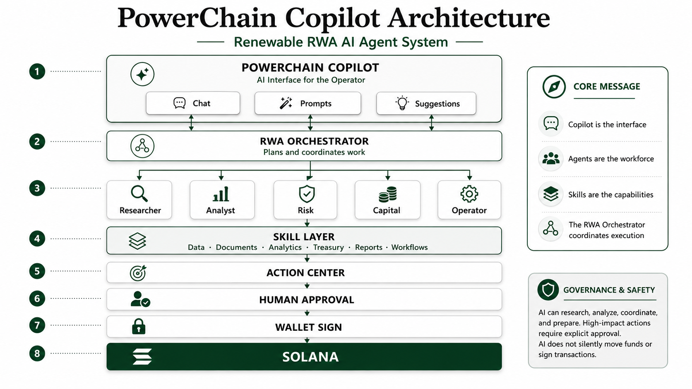

# PowerChain 1.0.0

PowerChain is a Digital Energy Operating System for physical-energy operations, verified Energy RWA, local markets, metering, settlement, AI-assisted workflows, and multi-network Solana/Sui infrastructure.

## Description

PowerChain unifies physical energy infrastructure, a canonical Energy Ledger, verified PET-20 Energy RWA, local markets and digital settlement in one production-oriented platform. Operators can monitor assets and digital twins, trade energy and environmental value, automate evidence-backed settlement, and connect enterprise systems with Solana and Sui networks. The repository is a pnpm/Turbo monorepo with one primary Next.js platform, independently deployable services, reusable domain packages, PostgreSQL/Supabase persistence, and infrastructure definitions for local, edge, and cloud deployments.

## Core features

- Canonical integer-Wh Energy Ledger: Energy Proof → Batch → Position → retirement
- PET-20 verified Energy RWA with bounded Solana/Sui representations and Asset Graph provenance
- LIVE PostgreSQL runtime with durable idempotency/audit; explicitly labeled DEMO mode when no database is configured

- Renewable asset operations, telemetry, metering, forecasting, and digital twins
- P2P energy exchange, marketplace checkout, PPAs, credits, and settlement workflows
- PWRC utility token, Sui-bridged wPWRC, and CRT carbon credit token experiences
- Proof of Energy, certification, audit evidence, conformance, and traceability
- Solana and Sui wallet, RPC, liquidity, asset, bridge, and payment integrations
- Helius, Helium, Metaplex, Jupiter, Raydium, Meteora, Orca, Cetus, and Pyth adapters
- Stripe, MoonPay, Coinbase Pay, Solana Pay, and Circle payment boundaries
- AI-assisted operations, protected gateways, WebSockets, workers, and observability
- PostgreSQL/Prisma, Supabase Auth/SSR, tenant-aware access, schemas, and migrations
- Docker, Kubernetes, Terraform, Cloudflare, Vercel, and AWS deployment assets

## Monorepo layout

| Area                                                              | Canonical owner                |
| ----------------------------------------------------------------- | ------------------------------ |
| Production Next.js application and API routes                     | `apps/platform`                |
| Deployable application runtime and HTTP adapter                   | `packages/application-runtime` |
| Configuration, environment parsing, routes, redirects, clusters   | `packages/configuration`       |
| Shared contexts, constants, common components, helpers and errors | `packages/shared`              |
| Reusable PowerChain UI and toast system                           | `packages/ui`                  |
| TypeScript types and all validation schemas                       | `packages/types`               |
| Catalog data, state stores and storage adapters                   | `packages/data`                |
| Application actions and action manifest                           | `packages/actions`             |
| Prisma, migrations, PostgreSQL, Neon and Supabase clients         | `packages/database`            |
| Canonical Wh energy accounting and lifecycle                     | `packages/energy-core`         |
| PET-20 Energy RWA and representation invariants                     | `packages/energy-rwa`          |
| Canonical energy relationship graph                                 | `packages/asset-graph`         |
| Digital Energy aggregate runtime and summaries                      | `packages/digital-energy`      |
| Provider and enterprise integration adapters                      | `packages/integration`         |
| Anchor/Rust programs and network configuration                    | `packages/programs/anchor`     |
| Docker, Kubernetes and Terraform                                  | `packages/infrastructure`      |
| Repository checks, scripts and smoke tests                        | `packages/tooling`             |
| Architecture and engineering artifacts                            | `packages/engineering`         |
| Human-readable documentation and OpenAPI                          | `docs`                         |

The repository root intentionally contains only release documents and the configuration files required by Git, pnpm, Turbo, TypeScript, linting, Docker, and environment bootstrapping. Deprecated root copies are rejected by `pnpm duplicates:check`.

## Requirements

- Node.js 24.19 or newer (below Node 27)
- pnpm 11.22.0
- Rust 1.98.0 and Anchor 1.1.2 for Solana program work
- PostgreSQL 18 and Redis 8 for the local container stack

## Start locally

```bash
corepack enable
pnpm install --frozen-lockfile
cp .env.example .env.local
pnpm dev
```

Open `http://localhost:3000`. The committed `.env.local` contains safe development defaults only and is ignored by Git; provider secrets must remain local.

Run the complete application fleet when working across service boundaries:

```bash
pnpm dev:all
```

`pnpm dev:services` starts the public web, API, checkout, marketplace, AI,
integration, explorer, WebSocket, and worker services without the platform,
documentation, or Storybook apps. See `docs/architecture/APPLICATIONS.md` for
ports, health endpoints, and service ownership.


## Digital Energy OS

The primary dashboard is wired to `/api/v1/digital-energy/overview`. Dedicated operator workspaces are available at `/digital-energy`, `/energy-rwa`, and `/asset-graph`. Physical energy remains authoritative; blockchain is used for settlement, provenance and optional representation.

Economic writes require `Idempotency-Key` and fail closed if a configured production database is unavailable. See `docs/DIGITAL-ENERGY-OS.md`.

## Quality gates

```bash
pnpm validate
pnpm typecheck
pnpm build
```

`pnpm validate` checks routes, redirects, schemas, migrations, program layout, contracts, documentation, interactions, imports, workspace versions, application wiring, and duplicate ownership. `pnpm build` builds every app workspace; `pnpm build:platform` builds only the primary Next.js platform.

## Database

```bash
pnpm db:generate
pnpm db:migrate
pnpm db:studio
```

The Prisma schema and migration history live only in `packages/database/prisma`. Supabase SSR uses publishable/secret keys and cookie `getAll`/`setAll` adapters; legacy anon/service-role environment names are not used.

## Programs

```bash
pnpm programs:check
pnpm programs:check:rust
pnpm programs:build
```

The Rust toolchain is pinned in `packages/programs/anchor/rust-toolchain.toml`. Anchor and Solana network configuration are in the same package.

## Containers

```bash
pnpm docker:build
pnpm docker:up
```

Docker assets are under `packages/infrastructure/docker`; Kubernetes and Terraform definitions share the infrastructure package.

## Cloud deployment

| Target     | Recommended workload                                      | Canonical configuration                      |
| ---------- | --------------------------------------------------------- | -------------------------------------------- |
| Vercel     | Next.js platform and route handlers                       | `packages/infrastructure/vercel/vercel.json` |
| Cloudflare | Edge gateway, caching, WAF, and origin proxy              | `packages/infrastructure/cloudflare`         |
| AWS        | Container fleet on ECS/Fargate with managed data services | `packages/infrastructure/aws`                |
| Kubernetes | Full multi-service fleet                                  | `packages/infrastructure/k8s`                |

Deployment commands, environment boundaries, and provider-specific setup are documented in `docs/deployment/CLOUD-PROVIDERS.md`.

## Documentation

See `docs/README.md` for architecture, standards, program, API, security, deployment, and integration guidance. Machine-readable OpenAPI is canonical at `docs/api/swagger.yaml` and can be copied to the app with `pnpm openapi:generate`.

## Security

Never commit API keys, database passwords, private keys, wallet seed phrases, or production RPC credentials. Use server-only environment variables and a deployment secret manager. PowerChain requests wallet signatures and public addresses only; it never needs recovery phrases.

## License

Proprietary software unless a package states otherwise.


## Digital Energy OS v1.0.0 — canonical institutional controls

The canonical v1.0.0 release carries physical energy through Digital Twin operations, verified Energy RWA, reservation-backed delivery, meter evidence, reconciliation, deterministic settlement review, maker-checker approval and financial settlement without collapsing those domains.

```text
Electricity ≠ Energy RWA ≠ Delivery ≠ Money ≠ PWRC ≠ wPWRC
```

Operator workspaces:

```text
/digital-energy
/digital-energy/twin
/energy-operations
/energy-rwa
/asset-graph
/digital-energy/controls
```

Settlement control:

```text
Reconciled delivery
→ financial proposal
→ SHA-256 review hash
→ distinct checker approvals
→ submission
→ transactional outbox
→ downstream event sink
```

Physical delivery evidence remains authoritative.

See `docs/DIGITAL-ENERGY-OS.md`, `docs/DIGITAL-ENERGY-OPERATIONS.md`, `docs/DIGITAL-ENERGY-CONTROLS.md`, and `docs/IMPROVEMENTS.md`.


## PowerChain Copilot

**PowerChain Copilot is the unified AI operator interface for Renewable RWA and Digital Energy OS.**

```text
Copilot is the interface.
Agents are the workforce.
Skills are the capabilities.
The RWA Orchestrator coordinates execution.
```

### Copilot architecture



Static application asset:

```text
/public/images/architectures/powerchain-copilot-architecture.png
```

Interactive architecture workspace:

```text
/copilot/architecture
```

The same canonical diagram is rendered inside the Copilot product workspace and has a dedicated responsive architecture page covering orchestration, context boundaries, authority boundaries and source-of-truth separation.

Canonical operator flow:

```text
Ask / Analyze / Research / Act
          ↓
RWA Orchestrator
          ↓
Renewable RWA specialist agents
          ↓
Reusable skills
          ↓
Evidence / findings / reviewable draft
          ↓
Action Center
          ↓
Human approval
          ↓
External wallet signature if required
```

Copilot is globally available from the application header and understands route context such as assets, projects, Energy RWA, portfolios, treasury, funding rounds and documents.

Canonical routes:

```text
/copilot
/copilot/architecture
/copilot/action-center
/copilot/agents
/copilot/skills
/copilot/prompts
/copilot/settings
/products
```

Canonical API:

```text
GET  /api/v1/copilot/registry
POST /api/v1/copilot/plan
POST /api/v1/copilot/run
GET  /api/v1/copilot/actions
POST /api/v1/copilot/actions/:id/approve
POST /api/v1/copilot/actions/:id/reject
```

High-impact action policy:

```text
READ
→ ANALYZE
→ DRAFT
→ RECOMMEND
→ REQUEST APPROVAL
→ HUMAN APPROVES
→ WALLET SIGNS
```

AI cannot silently move funds, modify critical asset records, or sign wallet transactions.

See `docs/POWERCHAIN-COPILOT.md` and `docs/PRODUCTS.md`.


## Local Energy OS

PowerChain Local Energy OS coordinates households, prosumers, energy communities, grid operators and distributed energy resources while preserving physical electricity as the source of truth.

```text
Measure
→ Verify
→ Locate
→ Prove
→ Position
→ Reserve
→ Route
→ Trade
→ Deliver
→ Reconcile
→ Settle
→ Retire
→ Reward
```

Canonical product routes:

```text
/local-energy
/local-energy/marketplace
/local-energy/grid
/local-energy/devices
/local-energy/settlement
```

`/p2p-energy` is retained as a compatibility route to the canonical Local Energy marketplace.

Product API:

```text
GET /api/v1/local-energy/overview
```

Marketplace APIs remain under `/api/v1/p2p/*`.

Core rule:

```text
Physical Energy
≠ Energy RWA
≠ Financial Settlement
≠ PWRC
≠ wPWRC
```

See `docs/LOCAL-ENERGY-OS.md`.


### Atomic Local Energy reservations

The canonical Local Energy market now persists integer-Wh listings, orders, flexibility requests, audit events and idempotency records.

```text
Listing capacity
→ advisory lock
→ SELECT FOR UPDATE
→ grid/availability validation
→ idempotent reservation
→ meter-evidenced delivery
→ reconciliation
→ settlement-ready
→ external financial settlement
```

A configured LIVE database is fail-closed: database failures never become demo economic writes.

Canonical persistence migration:

```text
20260824000200_local_energy_os
```
